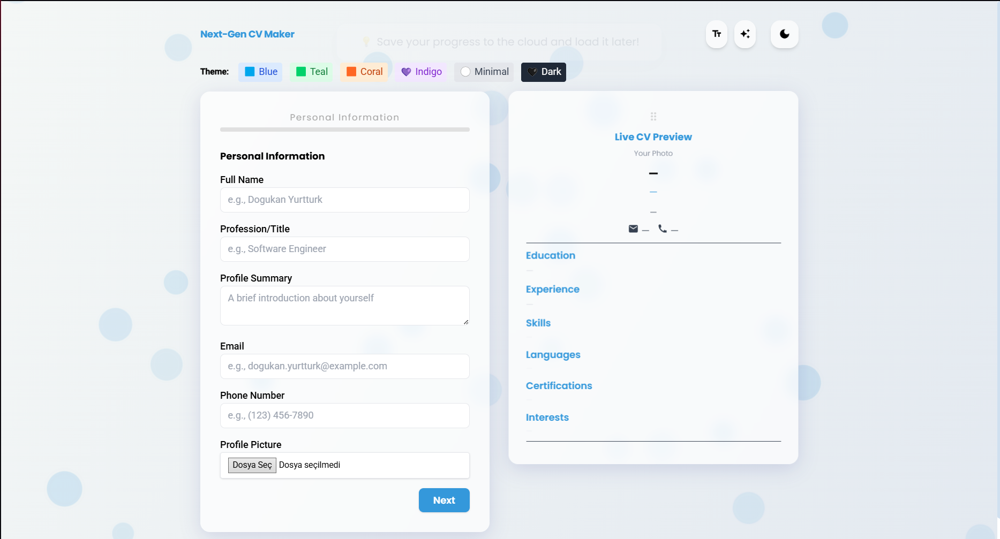

Next-Gen CV Maker
=================

This project is a dynamic web application that allows users to create professional and modern resumes (CVs) by entering their information step-by-step. Thanks to the live preview feature, users can instantly track how the information they enter appears on the CV.

Features
----------

*   **Live CV Preview:** As you enter data into the form fields, your CV is updated in real-time in the preview panel on the right.
    
*   **Multi-Step Form Structure:** Easily navigate between sections like Personal Information, Education, Experience, and Skills using the "Next" button.
    
*   **Customizable Themes:** Various theme options, including **Blue, Teal, Coral, Indigo, Minimal,** and **Dark** mode, allow users to customize their CVs to their liking.
    
*   **Firebase Database Integration:** Firebase integration for securely storing the created CV data for later access.
    
*   **Comprehensive CV Sections:**
    
    *   Personal Information (Name, Title, Summary, Contact, etc.)
        
    *   Education
        
    *   Experience
        
    *   Skills
        
    *   Languages
        
    *   Certifications
        
    *   Interests
        

Screenshot
-------------

Tech Stack
--------------

*   **HTML:** For the basic structure of the page.
    
*   **CSS:** For styling, design, and visual arrangements.
    
*   **JavaScript:** For form management, live preview logic, and all dynamic interactions.
    
*   **Firebase:** The database service used for storing and managing data in the cloud (Firestore or Realtime Database).
    

## Firebase Configuration

This project uses Firebase for real-time database and authentication.

To run this project on your own Firebase project:

1. Create a Firebase project at [firebase.google.com](https://firebase.google.com/)
2. Enable the required services (e.g. Realtime Database or Firestore)
3. Go to **Project Settings** > **General** and find your Firebase config
4. Create a file called `.env.local` in the root directory and add the following:

NEXT_PUBLIC_FIREBASE_API_KEY=your_api_key
NEXT_PUBLIC_FIREBASE_AUTH_DOMAIN=your_project.firebaseapp.com
NEXT_PUBLIC_FIREBASE_PROJECT_ID=your_project_id
NEXT_PUBLIC_FIREBASE_STORAGE_BUCKET=your_project.appspot.com
NEXT_PUBLIC_FIREBASE_MESSAGING_SENDER_ID=your_sender_id
NEXT_PUBLIC_FIREBASE_APP_ID=your_app_id

Setup and Launch
-------------------

1.  git clone https://github.com/your-username/cv-maker.git
    
2.  cd cv-maker
    
3.  Open the index.html file in your favorite web browser.

##Developers

- Doğukan Yurtturk ([GitHub](https://github.com/dgkann))  
- Abdullah Acar
- Deniz Beril Pekin
